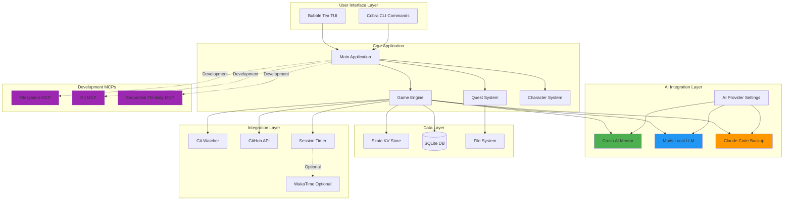
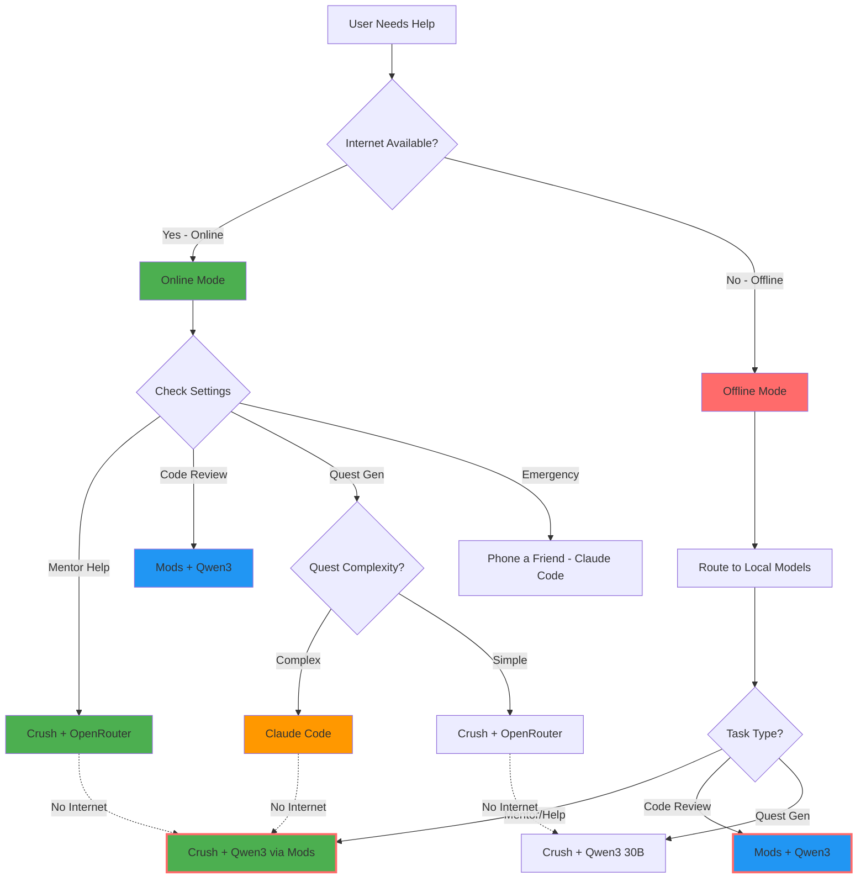
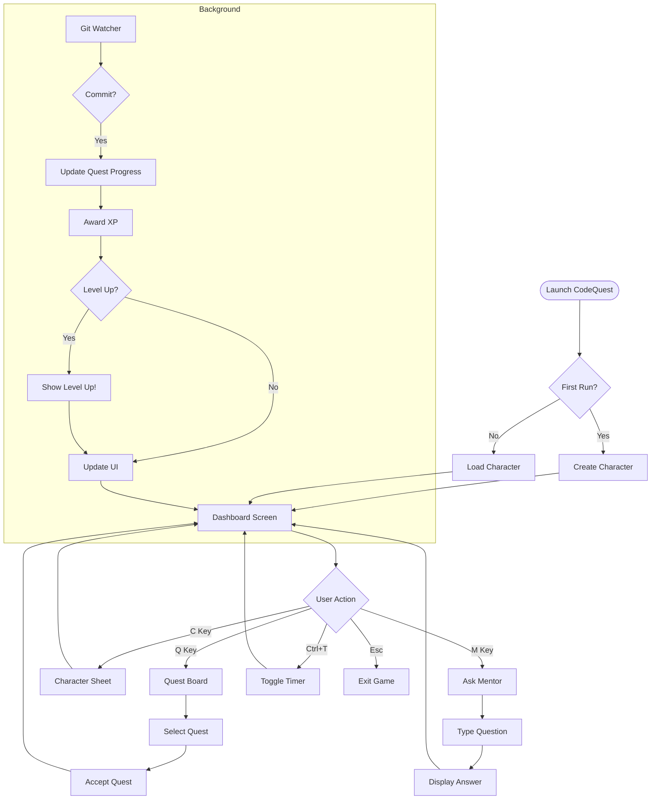
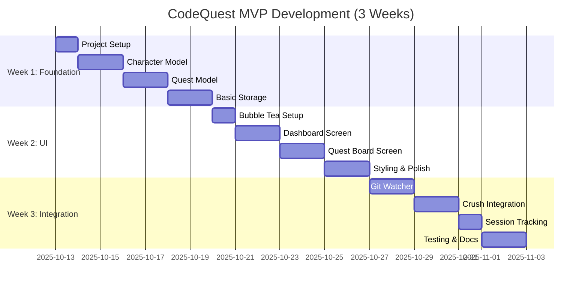
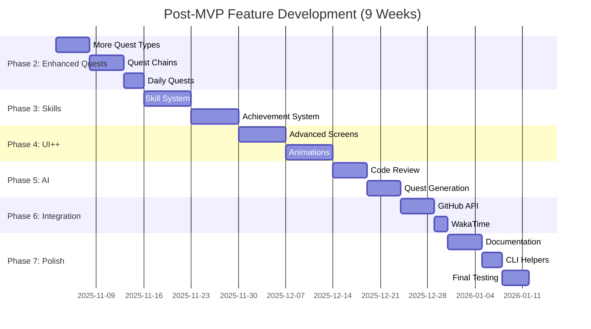

# CodeQuest Technical Specification

> **A terminal-based gamified developer productivity RPG built with Go and the Charmbracelet ecosystem**

**Version:** 1.0  
**Last Updated:** October 2025  
**Target Audience:** Python developers learning Go  
**Primary Development Tool:** Claude Code + MCPs  
**Status:** Pre-development

---

## Table of Contents

1. [Project Overview](#project-overview)
2. [Core Philosophy](#core-philosophy)
3. [System Architecture](#system-architecture)
4. [AI Integration Strategy](#ai-integration-strategy)
5. [MVP Specification](#mvp-specification)
6. [Complete Feature Set](#complete-feature-set)
7. [Technical Stack](#technical-stack)
8. [Project Structure](#project-structure)
9. [Data Models](#data-models)
10. [Development Roadmap](#development-roadmap)
11. [Go Learning Path](#go-learning-path)
12. [Development Guidelines](#development-guidelines)
13. [Configuration System](#configuration-system)
14. [Future Enhancements](#future-enhancements)

---

## Project Overview

### What is CodeQuest?

CodeQuest transforms your coding work into an RPG adventure. Every commit earns XP, every bug fix is a quest, and your real development progress drives your character's growth. It's a productivity tool disguised as a game—or a game that makes you more productive.

### Primary Goals

1. **Educational**: Learn Go through building a real, useful application
2. **Practical**: Create a genuinely helpful developer productivity tool
3. **Beautiful**: Showcase the Charmbracelet ecosystem's capabilities
4. **Fun**: Make coding feel like an adventure

### Key Features

- 🎮 **RPG Character Progression** - Level up as you code
- 📋 **Quest System** - Turn tasks into adventures
- ⚔️ **Combat Mode** - Real-time coding session tracking
- 🤖 **AI Mentor (Crush)** - In-game AI assistant for help and guidance
- 📊 **Stats & Achievements** - Track your coding journey
- 🎨 **Beautiful TUI** - Powered by Bubble Tea, Lip Gloss, and Bubbles
- ⏱️ **Session Tracking** - Built-in timer with optional WakaTime integration
- 🔧 **Fully Configurable** - Customize AI providers, tracking, and more

---

## Core Philosophy

### Real Work First

The game should **enhance**, not replace, real development work. Every game mechanic must map to actual productive activity:

- **XP comes from commits**, not clicking buttons
- **Quests represent real tasks**, not busywork
- **Stats reflect actual skills**, not arbitrary numbers
- **Progress requires code**, not grinding

### Learning Through Building

This project is designed to teach Go by doing:

- **Incremental complexity** - Start simple, add features progressively
- **Practical patterns** - Learn Go idioms through real use cases
- **Comprehensive documentation** - Every concept explained in context
- **Hands-on experience** - Modify, extend, and experiment

### Beautiful AND Functional

Showcase what's possible with modern terminal UIs:

- Smooth animations and transitions
- Responsive, adaptive layouts
- Rich colors and styling
- Delightful user experience

---

## System Architecture

### High-Level Architecture



### Component Overview

| Component | Purpose | Technology |
|-----------|---------|------------|
| **TUI** | Interactive game interface | Bubble Tea, Lip Gloss, Bubbles |
| **CLI** | Quick commands without TUI | Cobra |
| **Game Engine** | Core game logic, XP, quests | Pure Go |
| **AI Layer** | In-game mentor and assistance | Crush (primary), Mods, Claude Code |
| **Storage** | Data persistence | Skate (user data), SQLite (static data) |
| **Watchers** | Track git activity | fsnotify, go-git |
| **Integrations** | External services | GitHub API, WakaTime API |

---

## AI Integration Strategy

### Three-Tier AI System

CodeQuest supports multiple AI providers with user-configurable preferences:

#### 1. **Crush** (Primary Mentor)

**Role**: Main in-game AI companion for gameplay features

**What is Crush?**: Crush is a multi-provider AI client (like Mods) that can connect to various LLM providers. It's **not** a model itself, but a versatile interface to multiple models.

**Default Model Configuration (Online)**:
- **Complex Tasks**: Kimi K2 0925 via OpenRouter (reasoning, quest generation, deep analysis)
- **Simple Tasks**: GLM-4.5 Air via OpenRouter (quick help, hints, simple questions)

**Offline Mode**:
When internet is unavailable, Crush automatically switches to local models:
- **Complex Tasks**: Qwen3 30B via Ollama/Mods
- **Simple Tasks**: Qwen3 4B via Ollama/Mods

**Used For**:
- In-game hints and guidance
- Quest assistance
- General coding questions during gameplay
- Contextual help in TUI
- Side-by-side coding assistance (future: multi-window support)

**Implementation**:
- Integrated via Crush CLI
- Accessible through `/mentor` command in TUI
- Quick help modal with `[Alt+M]` key
- API keys stored securely in Skate
- Automatic online/offline mode detection

**Default Configuration**:
```toml
[ai.mentor]
provider = "crush"

# Online models (via OpenRouter)
model_complex = "openrouter/kimi/k2-0925"
model_simple = "openrouter/deepseek/glm-4.5-air"

# Offline fallback models (local)
model_complex_offline = "ollama/qwen3:30b"
model_simple_offline = "ollama/qwen3:4b"

temperature = 0.7
auto_detect_offline = true  # Automatically switch to offline models
```

**API Key Storage**:
API keys are stored securely using Skate's encrypted storage:
```bash
# Stored in Skate, never in plaintext config files
skate set codequest.openrouter_api_key "sk-or-v1-..."
```

#### 2. **Mods + Local LLM** (Code Review & Offline Fallback)

**Role**: Default code review and offline operation support

**Models**:
- **Primary**: Qwen3 30B (comprehensive reviews, offline Crush fallback)
- **Fallback**: Qwen3 4B (quick checks, resource-constrained environments)

**Used For**:
- Automatic code review after commits
- Code quality analysis
- Go idiom suggestions
- Performance recommendations
- **Offline mode for Crush** (when no internet connection)

**Implementation**:
```bash
# Code review via Mods
mods -m qwen3:30b "Review this Go code for idioms and improvements: $(git diff HEAD~1)"

# Offline Crush queries route through Mods
mods -m qwen3:30b "Help me understand Go interfaces"
```

**Default Configuration**:
```toml
[ai.review]
provider = "mods"
model_primary = "qwen3:30b"
model_fallback = "qwen3:4b"
auto_review = true
bonus_xp_enabled = true

[ai.offline]
enabled = true
detection = "auto"  # Automatically detect internet connectivity
use_local_models = true
```

**Offline Mode Behavior**:
When CodeQuest detects no internet connection:
1. Crush automatically switches to Mods with Qwen3 models
2. User is notified: "🔌 Offline Mode - Using local models"
3. All functionality continues to work
4. Automatic switch back when internet returns

#### 3. **Claude Code** (Advanced Features + Backup)

**Role**: Complex tasks and backup when local LLMs unavailable

**Used For**:
- Quest generation (default for complex quests)
- Tutorial creation
- Learning path suggestions
- "Phone a friend" emergency help
- Code scaffolding

**Implementation**:
- Execute via CLI: `claude code`
- Structured prompts for quest generation
- MCP integration during development

**Default Configuration**:
```toml
[ai.advanced]
provider = "claude-code"
quest_generation = "claude-code"  # Can override to "crush" or "mods"
available_as_backup = true
```

### User Configuration Flow



### Settings Menu

Users can configure AI providers in Settings (`Alt+S` in non-Dashboard screens, `S` in Dashboard):

```
╭────────────────────────────────────────────────╮
│            AI Configuration                    │
├────────────────────────────────────────────────┤
│ Primary Mentor (Crush):                        │
│   Online Models (OpenRouter):                  │
│     Complex: ● Kimi K2 0925 (Default)          │
│              ○ Custom...                       │
│     Simple:  ● GLM-4.5 Air (Default)           │
│              ○ Custom...                       │
│                                                │
│   Offline Models (Local):                      │
│     Complex: ● Qwen3 30B                       │
│     Simple:  ● Qwen3 4B                        │
│                                                │
│   [ ] Configure in Crush UI instead            │
│                                                │
│ Code Review Provider:                          │
│   ● Mods (Local - Qwen3)                       │
│   ○ Claude Code                                │
│   ○ Disabled                                   │
│                                                │
│ Quest Generation:                              │
│   ○ Crush (Simple quests)                      │
│   ● Claude Code (Complex - Default)            │
│   ○ Mods (Offline fallback)                    │
│                                                │
│ Offline Mode:                                  │
│   ● Auto-detect (Recommended)                  │
│   ○ Always use local models                    │
│   ○ Disabled                                   │
│                                                │
│ Backup Provider:                               │
│   ● Claude Code (Enabled)                      │
│   ○ None                                       │
│                                                │
│ API Keys: [Configure Securely via Skate]      │
╰────────────────────────────────────────────────╯

Keybinds shown at bottom: [↑↓] Navigate  [Space] Toggle  [Enter] Save  [Esc] Cancel
```

### Keybind Conventions

CodeQuest follows a consistent keybind pattern to prevent accidental actions and conflicts with text input:

#### Dashboard Screen (Non-Input Mode)
**Single keys allowed** - No text input, safe for quick access:
```
[Q] Quest Board          [C] Character Sheet
[I] Inventory            [M] Mentor
[S] Settings             [T] Toggle Timer
[H] Help                 [Esc] Exit
```

#### All Other Screens (Input/Interactive Mode)
**Modifiers required** - Prevents conflicts with typing:
```
[Alt+Q] Return to Dashboard    [Alt+M] Quick Mentor Help
[Alt+S] Settings               [Alt+T] Toggle Timer
[Alt+H] Help Overlay           [Alt+/] Command Palette
[Esc] Back/Cancel
```

#### Universal Keybinds
Available everywhere:
```
[Ctrl+T] Toggle Session Timer (Global)
[Ctrl+C] Quit application
[Esc]    Back/Cancel/Close modal
```

#### Visual Keybind Hints

Always displayed at bottom of every screen:

```
╭─────────────────────────────────────────────────────────╮
│                     [DASHBOARD]                         │
│                                                         │
│  Welcome back, CodeWarrior!        Level: 5 (450 XP)   │
│                                                         │
│  ... content ...                                        │
│                                                         │
├─────────────────────────────────────────────────────────┤
│ [Q] Quests  [C] Character  [I] Inventory  [M] Mentor   │
│ [S] Settings  [T] Timer  [H] Help  [Esc] Exit          │
╰─────────────────────────────────────────────────────────╯
```

```
╭─────────────────────────────────────────────────────────╮
│                    [QUEST BOARD]                        │
│                                                         │
│  Active Quest: Feature Implementation (3/10 commits)    │
│                                                         │
│  ... content ...                                        │
│                                                         │
├─────────────────────────────────────────────────────────┤
│ [Alt+Q] Dashboard  [Alt+M] Mentor  [Alt+S] Settings    │
│ [↑↓] Navigate  [Enter] Accept  [Esc] Back              │
╰─────────────────────────────────────────────────────────╯
```

#### Rationale

- **Dashboard = Safe Zone**: No text input, quick navigation
- **Modifier Keys Elsewhere**: Prevents accidental triggers while typing
- **Consistency**: Alt for navigation, Ctrl for global actions
- **Discoverability**: Always visible at bottom of screen
- **Accessibility**: Can be remapped in settings

---

## MVP Specification

### Goal

Build the **minimum playable version** that teaches Go fundamentals and demonstrates core concepts. This MVP will be used to develop the rest of the application.

### MVP Features

#### ✅ Core Features (Week 1-3)

1. **Character System**
   - Create character with name
   - Basic stats (Level, XP, Code Power)
   - XP gain from commits
   - Level-up system with XP curve

2. **Quest System (Basic)**
   - 2 quest types:
     - **Commit Quest**: "Make N commits"
     - **Lines Quest**: "Add/modify N lines of code"
   - Quest acceptance/completion
   - XP rewards

3. **TUI Interface**
   - Dashboard screen (character info, active quest)
   - Quest board screen (available quests)
   - Simple navigation (arrow keys, Enter, Esc)
   - Basic styling with Lip Gloss

4. **Git Integration**
   - Watch current directory for commits
   - Parse commit data (files changed, lines added/removed)
   - Fire events on new commits

5. **Data Persistence**
   - Save/load character via Skate
   - Save/load quests via Skate
   - Basic error handling

6. **AI Integration (Crush)**
   - Simple mentor command `/mentor <question>`
   - Display response in modal dialog
   - Uses Mods with Crush model

7. **Session Tracking**
   - Built-in session timer
   - Global hotkey to show/hide timer (Ctrl+T)
   - Save session stats

#### 📦 MVP Deliverables

- Single binary: `codequest`
- Config file: `~/.config/codequest/config.toml`
- Data storage: Skate KV store
- Documentation: README with setup and usage
- Tests: Core models have unit tests (>60% coverage)

### MVP User Flow



### MVP Technology Stack

| Component | Library | Purpose |
|-----------|---------|---------|
| TUI Framework | Bubble Tea | Event-driven UI |
| Styling | Lip Gloss | CSS-like styling |
| Components | Bubbles | Pre-built UI components |
| CLI | Cobra | Command routing |
| Git | go-git | Git operations |
| File Watching | fsnotify | Detect file changes |
| Storage | Skate | Key-value persistence |
| AI | Mods | Local LLM integration |

### MVP File Structure

```
codequest/
├── cmd/
│   └── codequest/
│       └── main.go                 # Entry point
├── internal/
│   ├── game/
│   │   ├── character.go            # Character model & logic
│   │   ├── character_test.go
│   │   ├── quest.go                # Quest model & logic
│   │   ├── quest_test.go
│   │   └── engine.go               # Game engine (XP, leveling)
│   ├── ui/
│   │   ├── app.go                  # Main Bubble Tea app
│   │   ├── styles.go               # Lip Gloss styles
│   │   ├── dashboard.go            # Dashboard screen
│   │   ├── questboard.go           # Quest board screen
│   │   └── mentor.go               # Mentor dialog
│   ├── storage/
│   │   └── skate.go                # Skate wrapper
│   ├── watcher/
│   │   └── git.go                  # Git repository watcher
│   ├── ai/
│   │   └── crush.go                # Crush/Mods integration
│   └── config/
│       └── config.go               # Configuration loading
├── go.mod
├── go.sum
├── README.md
├── Makefile
└── .gitignore
```

### MVP Success Criteria

- [ ] User can create a character
- [ ] User can accept and complete a quest
- [ ] Git commits are detected and award XP
- [ ] Character levels up after earning enough XP
- [ ] User can ask Crush for help via `/mentor`
- [ ] Data persists between sessions
- [ ] All core models have passing tests
- [ ] TUI is responsive and doesn't crash
- [ ] README has clear setup instructions

---

## Complete Feature Set

### Post-MVP Features (Weeks 4-12)

Once the MVP is working, incrementally add these features:

#### Phase 2: Enhanced Quests (Week 4-5)

- [ ] More quest types (PR-based, test coverage, refactoring)
- [ ] Quest chains (prerequisites)
- [ ] Daily quests with bonus XP
- [ ] Quest difficulty levels
- [ ] Quest abandonment

#### Phase 3: Skills & Achievements (Week 6-7)

- [ ] Skill tree system
- [ ] Skill unlocking based on quest completion
- [ ] Achievement system
- [ ] Stat bonuses from skills

#### Phase 4: Advanced UI (Week 8-9)

- [ ] Character sheet screen
- [ ] Inventory/skills screen
- [ ] Settings screen
- [ ] Animations (level-up, achievement unlock)
- [ ] Help overlay

#### Phase 5: Advanced AI (Week 10)

- [ ] Code review system (Mods integration)
- [ ] Quest generation (Claude Code)
- [ ] Learning path suggestions
- [ ] Tutorial quest creation

#### Phase 6: Integrations (Week 11)

- [ ] GitHub API integration
- [ ] WakaTime integration
- [ ] Export stats to JSON/CSV

#### Phase 7: Polish (Week 12)

- [ ] VHS recording for demos
- [ ] Comprehensive documentation
- [ ] CLI helpers with Gum
- [ ] Configuration UI
- [ ] Error handling & recovery

---

## Technical Stack

### Core Technologies

#### Go Standard Library

- `encoding/json` - Data serialization
- `os/exec` - Execute shell commands
- `time` - Time tracking
- `sync` - Concurrency primitives

#### Charmbracelet Ecosystem

| Tool | Purpose | GitHub |
|------|---------|--------|
| **Bubble Tea** | TUI framework | [charmbracelet/bubbletea](https://github.com/charmbracelet/bubbletea) |
| **Lip Gloss** | Styling and layout | [charmbracelet/lipgloss](https://github.com/charmbracelet/lipgloss) |
| **Bubbles** | TUI components | [charmbracelet/bubbles](https://github.com/charmbracelet/bubbles) |
| **Skate** | Key-value storage | [charmbracelet/skate](https://github.com/charmbracelet/skate) |
| **Mods** | AI/LLM integration | [charmbracelet/mods](https://github.com/charmbracelet/mods) |
| **Gum** | Shell script styling | [charmbracelet/gum](https://github.com/charmbracelet/gum) |
| **Glow** | Markdown rendering | [charmbracelet/glow](https://github.com/charmbracelet/glow) |
| **VHS** | Terminal recording | [charmbracelet/vhs](https://github.com/charmbracelet/vhs) |

#### Third-Party Libraries

| Library | Purpose | GitHub |
|---------|---------|--------|
| **Cobra** | CLI framework | [spf13/cobra](https://github.com/spf13/cobra) |
| **go-git** | Git operations | [go-git/go-git](https://github.com/go-git/go-git) |
| **fsnotify** | File system events | [fsnotify/fsnotify](https://github.com/fsnotify/fsnotify) |
| **SQLite** | Relational database | [mattn/go-sqlite3](https://github.com/mattn/go-sqlite3) |

#### Development Tools

| Tool | Purpose |
|------|---------|
| **Claude Code** | AI pair programming |
| **MCP** | Tool integration (filesystem, git, thinking) |
| **golangci-lint** | Code linting |
| **go test** | Unit testing |
| **go mod** | Dependency management |

---

## Project Structure

### Complete Directory Layout

```
codequest/
│
├── cmd/
│   └── codequest/
│       └── main.go                 # Application entry point
│
├── internal/                       # Private application code
│   │
│   ├── game/                       # Core game logic
│   │   ├── character.go            # Character model and methods
│   │   ├── character_test.go
│   │   ├── quest.go                # Quest system
│   │   ├── quest_test.go
│   │   ├── engine.go               # Game engine (XP, rewards)
│   │   ├── engine_test.go
│   │   ├── events.go               # Event system (pub/sub)
│   │   ├── events_test.go
│   │   ├── skills.go               # Skill tree
│   │   ├── achievements.go         # Achievement system
│   │   └── combat.go               # Combat/session tracking
│   │
│   ├── ui/                         # Bubble Tea UI
│   │   ├── app.go                  # Main app model
│   │   ├── styles.go               # Lip Gloss styles
│   │   ├── keys.go                 # Keyboard bindings
│   │   ├── screens/                # Screen components
│   │   │   ├── dashboard.go        # Main hub
│   │   │   ├── questboard.go       # Quest selection
│   │   │   ├── character.go        # Character sheet
│   │   │   ├── inventory.go        # Skills/achievements
│   │   │   ├── combat.go           # Active coding view
│   │   │   ├── mentor.go           # AI mentor interface
│   │   │   └── settings.go         # Configuration
│   │   └── components/             # Reusable components
│   │       ├── header.go
│   │       ├── statbar.go
│   │       ├── modal.go
│   │       └── timer.go
│   │
│   ├── storage/                    # Data persistence
│   │   ├── skate.go                # Skate KV wrapper
│   │   ├── skate_test.go
│   │   ├── sqlite.go               # SQLite operations
│   │   ├── sqlite_test.go
│   │   └── migrations/             # Database migrations
│   │       └── 001_init.sql
│   │
│   ├── watcher/                    # File system watchers
│   │   ├── git.go                  # Git activity monitoring
│   │   ├── git_test.go
│   │   └── session.go              # Session time tracking
│   │
│   ├── ai/                         # AI integration
│   │   ├── provider.go             # AI provider interface
│   │   ├── crush.go                # Crush integration (Mods)
│   │   ├── mods.go                 # Mods wrapper
│   │   ├── claude.go               # Claude Code integration
│   │   ├── review.go               # Code review system
│   │   └── questgen.go             # Quest generation
│   │
│   ├── integrations/               # External services
│   │   ├── github.go               # GitHub API
│   │   ├── github_test.go
│   │   └── wakatime.go             # WakaTime API (optional)
│   │
│   └── config/                     # Configuration
│       ├── config.go               # Config loading/saving
│       ├── defaults.go             # Default values
│       └── validate.go             # Config validation
│
├── pkg/                            # Public libraries (optional)
│   └── questgen/
│       └── templates.go            # Quest templates
│
├── data/                           # Static game data
│   ├── quests/                     # Quest definitions (JSON)
│   │   ├── starter/
│   │   ├── intermediate/
│   │   └── advanced/
│   ├── achievements.json           # Achievement definitions
│   ├── skills.json                 # Skill tree
│   └── lore/                       # Flavor text
│       └── intro.md
│
├── scripts/                        # Shell scripts
│   ├── install.sh                  # Installation script
│   ├── dev-setup.sh                # Development setup
│   └── recordings/                 # VHS recordings
│       ├── demo.tape
│       └── level-up.tape
│
├── docs/                           # Documentation
│   ├── README.md                   # User guide
│   ├── CONTRIBUTING.md             # Contributor guide
│   ├── ARCHITECTURE.md             # Technical overview
│   └── DEVELOPMENT.md              # Development guide
│
├── test/                           # Integration tests
│   ├── integration/
│   │   └── quest_test.go
│   └── fixtures/                   # Test data
│
├── .github/
│   └── workflows/
│       ├── test.yml                # CI/CD
│       └── release.yml             # Release automation
│
├── go.mod                          # Go module definition
├── go.sum                          # Dependency checksums
├── Makefile                        # Build automation
├── README.md                       # Project overview
├── LICENSE                         # MIT License
└── .gitignore                      # Git ignore rules
```

---

## Data Models

### Character Model

```go
// internal/game/character.go
package game

import "time"

// Character represents the player in the game world
type Character struct {
    // Identity
    ID        string    `json:"id"`
    Name      string    `json:"name"`
    CreatedAt time.Time `json:"created_at"`
    
    // Core Stats
    Level         int `json:"level"`
    XP            int `json:"xp"`
    XPToNextLevel int `json:"xp_to_next_level"`
    
    // RPG Stats
    CodePower int `json:"code_power"`  // Increases commit quality bonus
    Wisdom    int `json:"wisdom"`      // Increases XP gain
    Agility   int `json:"agility"`     // Faster quest completion bonuses
    
    // Progress Tracking
    TotalCommits      int       `json:"total_commits"`
    TotalLinesAdded   int       `json:"total_lines_added"`
    TotalLinesRemoved int       `json:"total_lines_removed"`
    QuestsCompleted   int       `json:"quests_completed"`
    CurrentStreak     int       `json:"current_streak"`
    LongestStreak     int       `json:"longest_streak"`
    LastActiveDate    time.Time `json:"last_active_date"`
    
    // Session Stats (Today)
    TodayCommits     int           `json:"today_commits"`
    TodayLinesAdded  int           `json:"today_lines_added"`
    TodaySessionTime time.Duration `json:"today_session_time"`
}

// NewCharacter creates a new character with starting stats
func NewCharacter(name string) *Character

// AddXP adds experience points and checks for level up
func (c *Character) AddXP(amount int) (leveledUp bool)

// CalculateXPForLevel calculates XP needed for a given level
func CalculateXPForLevel(level int) int

// UpdateStreak updates the daily streak counter
func (c *Character) UpdateStreak()
```

### Quest Model

```go
// internal/game/quest.go
package game

import "time"

// QuestStatus represents the current state of a quest
type QuestStatus string

const (
    QuestAvailable QuestStatus = "available"
    QuestActive    QuestStatus = "active"
    QuestCompleted QuestStatus = "completed"
    QuestFailed    QuestStatus = "failed"
)

// QuestType categorizes quests by their completion criteria
type QuestType string

const (
    QuestTypeCommit    QuestType = "commit"      // Make N commits
    QuestTypeLines     QuestType = "lines"       // Add/modify N lines
    QuestTypeTests     QuestType = "tests"       // Add N tests
    QuestTypePR        QuestType = "pr"          // Create/merge PR
    QuestTypeRefactor  QuestType = "refactor"    // Refactor code
    QuestTypeDaily     QuestType = "daily"       // Daily quest
)

// Quest represents a coding task or challenge
type Quest struct {
    // Identity
    ID          string    `json:"id"`
    Title       string    `json:"title"`
    Description string    `json:"description"`
    Type        QuestType `json:"type"`
    
    // Requirements
    RequiredLevel int      `json:"required_level"`
    Prerequisites []string `json:"prerequisites"` // Quest IDs
    
    // Objectives
    Target  int `json:"target"`   // Target count (commits, lines, etc.)
    Current int `json:"current"`  // Current progress
    
    // Rewards
    XPReward       int      `json:"xp_reward"`
    UnlocksSkills  []string `json:"unlocks_skills,omitempty"`
    UnlocksQuests  []string `json:"unlocks_quests,omitempty"`
    
    // Tracking
    GitRepo     string `json:"git_repo,omitempty"`     // Repo path
    GitBaseSHA  string `json:"git_base_sha,omitempty"` // Starting commit
    
    // Status
    Status      QuestStatus `json:"status"`
    StartedAt   *time.Time  `json:"started_at,omitempty"`
    CompletedAt *time.Time  `json:"completed_at,omitempty"`
    Progress    float64     `json:"progress"` // 0.0 to 1.0
}

// IsAvailable checks if the quest can be started
func (q *Quest) IsAvailable(character *Character) bool

// Start begins the quest
func (q *Quest) Start(repoPath, baseSHA string) error

// UpdateProgress increments quest progress
func (q *Quest) UpdateProgress(amount int)

// CheckCompletion determines if quest is complete
func (q *Quest) CheckCompletion() bool

// Complete marks the quest as finished
func (q *Quest) Complete() error
```

### Event Model

```go
// internal/game/events.go
package game

import (
    "sync"
    "time"
)

// EventType defines different event types in the game
type EventType string

const (
    EventCommit      EventType = "commit"
    EventLevelUp     EventType = "level_up"
    EventQuestStart  EventType = "quest_start"
    EventQuestDone   EventType = "quest_done"
    EventSkillUnlock EventType = "skill_unlock"
    EventAchievement EventType = "achievement"
)

// Event represents something that happened in the game
type Event struct {
    Type      EventType              `json:"type"`
    Timestamp time.Time              `json:"timestamp"`
    Data      map[string]interface{} `json:"data"`
}

// EventBus manages event publishing and subscription
type EventBus struct {
    handlers map[EventType][]EventHandler
    mu       sync.RWMutex
}

// EventHandler is a function that handles an event
type EventHandler func(Event) error

// NewEventBus creates a new event bus
func NewEventBus() *EventBus

// Subscribe registers a handler for an event type
func (eb *EventBus) Subscribe(eventType EventType, handler EventHandler)

// Publish sends an event to all subscribed handlers
func (eb *EventBus) Publish(event Event)
```

---

## AI Implementation Details

### Crush Integration

```go
// internal/ai/crush.go
package ai

import (
    "encoding/json"
    "fmt"
    "os/exec"
    "strings"
)

type CrushClient struct {
    configPath     string
    onlineMode     bool
    complexModel   string
    simpleModel    string
    offlineModels  OfflineModels
    apiKey         string
}

type OfflineModels struct {
    Complex string
    Simple  string
}

// NewCrushClient creates a new Crush client with automatic online/offline detection
func NewCrushClient(config *Config) (*CrushClient, error) {
    // Retrieve API key from Skate
    apiKey, err := config.GetAPIKey("openrouter_api_key")
    if err != nil {
        return nil, fmt.Errorf("OpenRouter API key not found: %w", err)
    }
    
    client := &CrushClient{
        configPath:    config.CrushConfigPath,
        complexModel:  config.AI.Mentor.ModelComplex,
        simpleModel:   config.AI.Mentor.ModelSimple,
        offlineModels: OfflineModels{
            Complex: config.AI.Mentor.ModelComplexOffline,
            Simple:  config.AI.Mentor.ModelSimpleOffline,
        },
        apiKey: apiKey,
    }
    
    // Detect online/offline mode
    client.onlineMode = detectInternetConnection()
    
    return client, nil
}

// Ask sends a question to Crush and returns the response
func (c *CrushClient) Ask(question string, complexity string) (string, error) {
    model := c.selectModel(complexity)
    
    var cmd *exec.Cmd
    if c.onlineMode {
        // Use Crush with OpenRouter models
        // Set API key as environment variable
        cmd = exec.Command("crush", "--model", model, question)
        cmd.Env = append(cmd.Env, fmt.Sprintf("OPENROUTER_API_KEY=%s", c.apiKey))
    } else {
        // Fall back to Mods with local models
        cmd = exec.Command("mods", "-m", model, question)
    }
    
    output, err := cmd.Output()
    if err != nil {
        return "", fmt.Errorf("AI query failed: %w", err)
    }
    
    return strings.TrimSpace(string(output)), nil
}

// selectModel chooses the appropriate model based on complexity and online status
func (c *CrushClient) selectModel(complexity string) string {
    if !c.onlineMode {
        // Offline mode: use local models
        if complexity == "complex" {
            return c.offlineModels.Complex
        }
        return c.offlineModels.Simple
    }
    
    // Online mode: use OpenRouter models
    if complexity == "complex" {
        return c.complexModel
    }
    return c.simpleModel
}

// detectInternetConnection checks if internet is available
func detectInternetConnection() bool {
    // Try to reach OpenRouter API
    cmd := exec.Command("ping", "-c", "1", "-W", "1", "openrouter.ai")
    err := cmd.Run()
    return err == nil
}

// SwitchToOfflineMode manually switches to offline mode
func (c *CrushClient) SwitchToOfflineMode() {
    c.onlineMode = false
}

// SwitchToOnlineMode manually switches to online mode (with check)
func (c *CrushClient) SwitchToOnlineMode() bool {
    if detectInternetConnection() {
        c.onlineMode = true
        return true
    }
    return false
}

// IsOnline returns current connectivity status
func (c *CrushClient) IsOnline() bool {
    return c.onlineMode
}
```

### Mods Integration for Code Review

```go
// internal/ai/mods.go
package ai

import (
    "fmt"
    "os/exec"
    "strings"
)

type ModsClient struct {
    primaryModel  string
    fallbackModel string
}

func NewModsClient(config *Config) *ModsClient {
    return &ModsClient{
        primaryModel:  config.AI.Review.ModelPrimary,
        fallbackModel: config.AI.Review.ModelFallback,
    }
}

// ReviewCode sends code to local LLM for review
func (m *ModsClient) ReviewCode(diff string) (*CodeReview, error) {
    prompt := fmt.Sprintf(`Review this Go code diff and provide:
1. Overall quality score (0-100)
2. Strengths
3. Areas for improvement
4. Go idioms/best practices
5. Suggested bonus XP (0-50)

Diff:
%s

Respond in JSON format.`, diff)
    
    // Try primary model first
    response, err := m.query(prompt, m.primaryModel)
    if err != nil {
        // Fall back to smaller model
        response, err = m.query(prompt, m.fallbackModel)
        if err != nil {
            return nil, fmt.Errorf("code review failed: %w", err)
        }
    }
    
    // Parse JSON response
    var review CodeReview
    if err := json.Unmarshal([]byte(response), &review); err != nil {
        return nil, fmt.Errorf("failed to parse review: %w", err)
    }
    
    return &review, nil
}

func (m *ModsClient) query(prompt, model string) (string, error) {
    cmd := exec.Command("mods", "-m", model, prompt)
    output, err := cmd.Output()
    if err != nil {
        return "", err
    }
    return strings.TrimSpace(string(output)), nil
}
```

### Claude Code Integration

```go
// internal/ai/claude.go
package ai

import (
    "fmt"
    "os/exec"
)

type ClaudeClient struct {
    projectRoot string
}

func NewClaudeClient(projectRoot string) *ClaudeClient {
    return &ClaudeClient{
        projectRoot: projectRoot,
    }
}

// GenerateQuest uses Claude Code to create a new quest
func (c *ClaudeClient) GenerateQuest(topic string) (*Quest, error) {
    prompt := fmt.Sprintf(`Generate a coding quest about: %s

Create a JSON object with:
- title: Quest title
- description: What the user will do
- type: Quest type (commit, lines, tests, etc.)
- target: Numeric goal
- xp_reward: XP to award
- hints: Array of helpful hints`, topic)
    
    response, err := c.query(prompt)
    if err != nil {
        return nil, err
    }
    
    // Parse and return quest
    var quest Quest
    if err := json.Unmarshal([]byte(response), &quest); err != nil {
        return nil, err
    }
    
    return &quest, nil
}

func (c *ClaudeClient) query(prompt string) (string, error) {
    cmd := exec.Command("claude", "code", "--prompt", prompt)
    cmd.Dir = c.projectRoot
    output, err := cmd.Output()
    if err != nil {
        return "", err
    }
    return string(output), nil
}
```

---

## Development Roadmap

### MVP Development Timeline



### Post-MVP Development



---

## Go Learning Path

### Concepts by Development Phase

This shows which Go concepts you'll learn during each phase of development:

```mermaid
graph TB
    subgraph "Week 1: Go Basics"
        W1A[Packages & Imports]
        W1B[Structs & Types]
        W1C[Methods vs Functions]
        W1D[Pointers & References]
        W1E[Error Handling]
        W1F[JSON Marshaling]
    end
    
    subgraph "Week 2: Go Intermediate"
        W2A[Interfaces]
        W2B[Type Assertions]
        W2C[Goroutines Intro]
        W2D[Channels Basics]
        W2E[Select Statement]
        W2F[Package Organization]
    end
    
    subgraph "Week 3: Go Patterns"
        W3A[Concurrency Patterns]
        W3B[Context Package]
        W3C[Sync Primitives]
        W3D[File I/O]
        W3E[Command Execution]
        W3F[Testing Best Practices]
    end
    
    subgraph "Week 4-5: Advanced Concepts"
        W4A[Generics]
        W4B[Reflection]
        W4C[Build Tags]
        W4D[Embedding]
        W4E[Custom Errors]
    end
    
    subgraph "Week 6+: Expert Topics"
        W6A[Performance Optimization]
        W6B[Memory Management]
        W6C[Profiling]
        W6D[Benchmarking]
        W6E[Cross-compilation]
    end
    
    W1A --> W1B --> W1C --> W1D --> W1E --> W1F
    W1F --> W2A --> W2B --> W2C --> W2D --> W2E --> W2F
    W2F --> W3A --> W3B --> W3C --> W3D --> W3E --> W3F
    W3F --> W4A --> W4B --> W4C --> W4D --> W4E
    W4E --> W6A --> W6B --> W6C --> W6D --> W6E
    
    style W1A fill:#4CAF50
    style W1B fill:#4CAF50
    style W1C fill:#4CAF50
    style W1D fill:#4CAF50
    style W1E fill:#4CAF50
    style W1F fill:#4CAF50
    style W2A fill:#2196F3
    style W2B fill:#2196F3
    style W2C fill:#2196F3
    style W2D fill:#2196F3
    style W2E fill:#2196F3
    style W2F fill:#2196F3
    style W3A fill:#FF9800
    style W3B fill:#FF9800
    style W3C fill:#FF9800
    style W3D fill:#FF9800
    style W3E fill:#FF9800
    style W3F fill:#FF9800
```



### Learning Resources

#### Go Fundamentals

- **Official Go Tour**: https://go.dev/tour/
- **Go by Example**: https://gobyexample.com/
- **Effective Go**: https://go.dev/doc/effective_go

#### Charmbracelet Learning

- **Bubble Tea Tutorial**: https://github.com/charmbracelet/bubbletea/tree/master/tutorials
- **Lip Gloss Examples**: https://github.com/charmbracelet/lipgloss/tree/master/examples
- **Bubbles Components**: https://github.com/charmbracelet/bubbles

#### Project-Specific

- **go-git Documentation**: https://pkg.go.dev/github.com/go-git/go-git/v5
- **Cobra User Guide**: https://github.com/spf13/cobra/blob/master/user_guide.md
- **fsnotify Examples**: https://github.com/fsnotify/fsnotify

---

## Development Guidelines

### Code Organization Principles

#### 1. **Package Structure**

Follow Go conventions:
- `internal/` - Private application code
- `pkg/` - Public libraries (if reusable)
- `cmd/` - Application entry points
- One package per directory
- Package name = directory name (usually)

#### 2. **Naming Conventions**

Go style guide:
- **Functions/Methods**: `CamelCase` (exported), `camelCase` (unexported)
- **Types**: `CamelCase` (exported), `camelCase` (unexported)
- **Interfaces**: `-er` suffix when possible (e.g., `Reader`, `Writer`)
- **Files**: `snake_case.go` or just `package.go`
- **Tests**: `*_test.go`

#### 3. **Error Handling**

Always handle errors explicitly:

```go
// ✅ Good
result, err := DoSomething()
if err != nil {
    return fmt.Errorf("doing something: %w", err)
}

// ❌ Bad
result, _ := DoSomething()  // Don't ignore errors!
```

#### 4. **Documentation**

Every exported item needs a doc comment:

```go
// Character represents the player in the game world.
// It tracks progression, stats, and activity.
type Character struct {
    // ...
}

// AddXP adds experience points to the character.
// Returns true if the character leveled up.
func (c *Character) AddXP(amount int) bool {
    // ...
}
```

### Testing Strategy

#### Unit Tests

Every core model should have comprehensive tests:

```go
// internal/game/character_test.go
package game

import "testing"

func TestCharacter_AddXP(t *testing.T) {
    tests := []struct {
        name        string
        startingXP  int
        addXP       int
        wantLevel   int
        wantLevelUp bool
    }{
        {
            name:        "normal XP gain, no level up",
            startingXP:  50,
            addXP:       30,
            wantLevel:   1,
            wantLevelUp: false,
        },
        {
            name:        "level up at threshold",
            startingXP:  90,
            addXP:       10,
            wantLevel:   2,
            wantLevelUp: true,
        },
    }
    
    for _, tt := range tests {
        t.Run(tt.name, func(t *testing.T) {
            char := NewCharacter("Test")
            char.XP = tt.startingXP
            
            leveledUp := char.AddXP(tt.addXP)
            
            if leveledUp != tt.wantLevelUp {
                t.Errorf("AddXP() levelUp = %v, want %v", leveledUp, tt.wantLevelUp)
            }
            if char.Level != tt.wantLevel {
                t.Errorf("AddXP() level = %v, want %v", char.Level, tt.wantLevel)
            }
        })
    }
}
```

#### Integration Tests

Test complete workflows:

```go
// test/integration/quest_test.go
package integration

func TestQuestCompletionFlow(t *testing.T) {
    // Setup test environment
    // Create character
    // Accept quest
    // Simulate commits
    // Verify quest completion
    // Verify XP awarded
}
```

### Git Workflow

#### Commit Messages

Follow conventional commits:

```
feat: add character leveling system
fix: correct XP calculation for multi-level gains
docs: add architecture documentation
test: add character model tests
refactor: extract quest progress logic
```

#### Branch Strategy

- `main` - Stable releases only
- `develop` - Active development
- `feature/*` - New features
- `fix/*` - Bug fixes
- `docs/*` - Documentation

### Claude Code Development Workflow

#### Using MCPs During Development

**Filesystem MCP** - For project exploration:
```
Claude Code: "Show me the current project structure"
→ Uses filesystem MCP to list directories
→ Displays organized tree view
```

**Git MCP** - For change tracking:
```
Claude Code: "What changed in the last commit?"
→ Uses git MCP to read commit diff
→ Explains changes and suggests improvements
```

**Sequential Thinking MCP** - For complex problems:
```
You: "I need to design the event system. Let's think through this."
→ Claude Code uses sequential-thinking MCP
→ Breaks down problem into steps
→ Evaluates trade-offs
→ Suggests optimal solution
```

#### Development Conversation Pattern

```
You: "Let's implement the Character model. I want to learn about:
      - Struct tags
      - Methods vs functions
      - Pointer receivers
      Start with character.go in internal/game/"

Claude Code: 
1. Creates character.go with commented code
2. Explains each concept
3. Shows examples
4. Creates character_test.go
5. Explains testing patterns

You: "Now let's refactor to use interfaces for storage"

Claude Code:
1. Uses sequential-thinking to plan refactor
2. Creates storage interface
3. Updates character to use interface
4. Shows dependency injection pattern
5. Updates tests with mocks

You: "Review this code I wrote for the quest system"

Claude Code:
1. Uses git MCP to see your changes
2. Analyzes code quality
3. Suggests Go idioms
4. Points out potential bugs
5. Recommends improvements
```

---

## Configuration System

### Configuration File

Location: `~/.config/codequest/config.toml`

**Note**: API keys are **never** stored in this file. They are stored securely in Skate's encrypted storage.

```toml
[character]
name = "CodeWarrior"

[game]
auto_start_quests = false
show_tips = true
difficulty = "normal"  # easy, normal, hard

[ui]
theme = "dark"  # dark, light, auto
show_animations = true
compact_mode = false
show_keybind_hints = true  # Always show keybinds at bottom

[tracking]
session_timer_enabled = true
session_hotkey = "ctrl+t"
wakatime_enabled = false
# WakaTime API key stored in Skate, not here

[ai]
# Primary mentor for in-game help
[ai.mentor]
provider = "crush"  # crush, claude-code
use_crush_ui_config = false  # If true, defer to Crush's own configuration

# Online models (via OpenRouter)
model_complex = "openrouter/kimi/k2-0925"
model_simple = "openrouter/deepseek/glm-4.5-air"

# Offline fallback models (local via Ollama/Mods)
model_complex_offline = "qwen3:30b"
model_simple_offline = "qwen3:4b"

temperature = 0.7
auto_select_model = true  # Use simple model for quick questions, complex for deep queries

# Code review provider
[ai.review]
provider = "mods"  # mods, claude-code, disabled
model_primary = "qwen3:30b"
model_fallback = "qwen3:4b"
auto_review = true
bonus_xp_enabled = true
review_threshold = "major"  # always, major, never (when to trigger auto-review)

# Quest generation
[ai.questgen]
provider = "claude-code"  # crush, mods, claude-code
complexity = "auto"  # simple, auto, complex
# Auto: simple quests use Crush, complex use Claude Code

# Backup provider when primary unavailable
[ai.backup]
provider = "claude-code"  # claude-code, none
enabled = true

# Offline mode configuration
[ai.offline]
detection = "auto"  # auto, manual, disabled
auto_switch_models = true  # Automatically use local models when offline
notify_on_switch = true    # Show "🔌 Offline Mode" notification

[git]
auto_detect_repos = true
watch_paths = [
    "~/projects",
]
ignore_patterns = [
    "node_modules",
    ".git",
    "vendor",
]

[github]
enabled = false
# GitHub token stored in Skate, not here
sync_issues = false
auto_create_quests = false

[keybinds]
# Dashboard (single keys allowed)
dashboard_quests = "q"
dashboard_character = "c"
dashboard_inventory = "i"
dashboard_mentor = "m"
dashboard_settings = "s"
dashboard_help = "h"

# Other screens (require modifiers)
global_dashboard = "alt+q"
global_mentor = "alt+m"
global_settings = "alt+s"
global_help = "alt+h"
global_timer = "ctrl+t"

[windows]
# Future: Multi-window support
multi_window_enabled = false  # Not yet implemented
default_layout = "single"     # single, side-by-side, custom

[debug]
log_level = "info"  # debug, info, warn, error
log_file = "~/.local/share/codequest/debug.log"
```

### Secure API Key Storage with Skate

API keys are stored in Skate's encrypted key-value store, **never in plaintext files**.

#### Setup API Keys

```bash
# OpenRouter API key (for Crush online models)
skate set codequest.openrouter_api_key "sk-or-v1-..."

# WakaTime API key (optional)
skate set codequest.wakatime_api_key "waka_..."

# GitHub token (optional)
skate set codequest.github_token "ghp_..."
```

#### Retrieving Keys in Code

```go
// internal/config/secrets.go
package config

import (
    "fmt"
    "os/exec"
    "strings"
)

// GetAPIKey retrieves an API key from Skate storage
func GetAPIKey(keyName string) (string, error) {
    cmd := exec.Command("skate", "get", fmt.Sprintf("codequest.%s", keyName))
    output, err := cmd.Output()
    if err != nil {
        return "", fmt.Errorf("failed to retrieve API key %s: %w", keyName, err)
    }
    return strings.TrimSpace(string(output)), nil
}

// SetAPIKey stores an API key in Skate
func SetAPIKey(keyName, value string) error {
    cmd := exec.Command("skate", "set", fmt.Sprintf("codequest.%s", keyName), value)
    if err := cmd.Run(); err != nil {
        return fmt.Errorf("failed to store API key %s: %w", keyName, err)
    }
    return nil
}

// DeleteAPIKey removes an API key from Skate
func DeleteAPIKey(keyName string) error {
    cmd := exec.Command("skate", "delete", fmt.Sprintf("codequest.%s", keyName))
    if err := cmd.Run(); err != nil {
        return fmt.Errorf("failed to delete API key %s: %w", keyName, err)
    }
    return nil
}
```

#### First-Time Setup Flow

```
╭───────────────────────────────────────────────╮
│         Welcome to CodeQuest! 🎮              │
├───────────────────────────────────────────────┤
│                                               │
│  Let's set up your AI providers.              │
│                                               │
│  OpenRouter API Key (for online AI):         │
│  [___________________________________]        │
│                                               │
│  ⚠️  Keys are stored securely in Skate        │
│     and never saved in plaintext.             │
│                                               │
│  [Skip] Use offline models only               │
│  [Continue] Save and proceed                  │
│                                               │
╰───────────────────────────────────────────────╯
```

### Configuration Validation

```go
// internal/config/validate.go
package config

import "fmt"

// Validate checks if the configuration is valid
func (c *Config) Validate() error {
    // Validate AI providers
    validProviders := map[string]bool{
        "crush":       true,
        "mods":        true,
        "claude-code": true,
        "disabled":    true,
        "none":        true,
    }
    
    if !validProviders[c.AI.Mentor.Provider] {
        return fmt.Errorf("invalid mentor provider: %s", c.AI.Mentor.Provider)
    }
    
    if !validProviders[c.AI.Review.Provider] {
        return fmt.Errorf("invalid review provider: %s", c.AI.Review.Provider)
    }
    
    // Validate paths
    // Validate API keys if features enabled
    // etc.
    
    return nil
}
```

### Default Configuration

```go
// internal/config/defaults.go
package config

// DefaultConfig returns the default configuration
func DefaultConfig() *Config {
    return &Config{
        Game: GameConfig{
            AutoStartQuests: false,
            ShowTips:        true,
            Difficulty:      "normal",
        },
        UI: UIConfig{
            Theme:          "dark",
            ShowAnimations: true,
            CompactMode:    false,
        },
        Tracking: TrackingConfig{
            SessionTimerEnabled: true,
            SessionHotkey:       "ctrl+t",
            WakaTimeEnabled:     false,
        },
        AI: AIConfig{
            Mentor: AIProviderConfig{
                Provider:    "crush",
                Model:       "crush",
                Temperature: 0.7,
            },
            Review: ReviewConfig{
                Provider:       "mods",
                ModelPrimary:   "qwen3:30b",
                ModelFallback:  "qwen3:4b",
                AutoReview:     true,
                BonusXPEnabled: true,
            },
            QuestGen: QuestGenConfig{
                Provider:   "claude-code",
                Complexity: "auto",
            },
            Backup: BackupConfig{
                Provider: "claude-code",
                Enabled:  true,
            },
        },
        Git: GitConfig{
            AutoDetectRepos: true,
            WatchPaths:      []string{"~/projects"},
        },
    }
}
```

---

## Future Enhancements

### Potential Features (Post v1.0)

#### Multi-Window TUI (High Priority)
- **Split-pane layout**: Crush on side, code/TUI in center
- **Tmux-style window management**: Multiple panes, resizable
- **Persistent layout**: Save and restore window configurations
- **Quick window switching**: Alt+1, Alt+2, Alt+3 for different panes
- **Implementation**: Using Bubble Tea's split view or integration with tmux
- **Use Cases**:
  - Code alongside Crush for real-time help
  - Monitor session stats while working
  - Keep quest objectives visible
  - Side-by-side code review

```
┌─────────────────────────────────────────────────────────┐
│                     CodeQuest (Multi-Window)            │
├──────────────────────┬──────────────────────────────────┤
│   Crush Mentor       │    Main View                     │
│                      │                                  │
│  > How do I          │  ╭──────────────────────────╮   │
│    implement this?   │  │   Active Quest           │   │
│                      │  │   Feature: Git Watcher   │   │
│  💭 To implement     │  │   Progress: 7/10         │   │
│     a Git watcher    │  ╰──────────────────────────╯   │
│     in Go, use the   │                                  │
│     fsnotify package │  Code Editor / Combat View      │
│     to watch...      │  (via external editor)          │
│                      │                                  │
│  > Ask another       │  Session Stats:                  │
│    question...       │  ⏱️  45:23  💻 5 commits         │
├──────────────────────┴──────────────────────────────────┤
│ [Alt+1] Crush  [Alt+2] Main  [Alt+3] Stats  [Ctrl+T] Timer │
└─────────────────────────────────────────────────────────┘
```

#### Web Dashboard
- View stats online
- Share achievements
- Leaderboards
- Quest marketplace

#### Multiplayer Features
- Guild system
- Shared quests
- Code review tournaments
- Pair programming mode

#### Advanced AI
- Custom quest generation from GitHub issues
- Automated code mentor during coding
- Smart skill recommendations
- Project complexity analysis

#### Plugin System
- Third-party quest packs
- Custom themes
- Integration with other tools
- Achievement mods

#### Mobile Companion
- View stats on phone
- Push notifications for achievements
- Quick quest creation
- Daily streaks tracking

#### IDE Integration
- VS Code extension
- JetBrains plugin
- Neovim integration
- Live progress overlay

---

## Quick Start

### Installation

```bash
# Clone the repository
git clone https://github.com/yourusername/codequest.git
cd codequest

# Install dependencies
go mod download

# Build the application
make build

# Or install globally
make install
```

### First Run

```bash
# Start CodeQuest
codequest

# Or use specific commands
codequest quest list
codequest stats
codequest mentor "How do I start?"
```

### Development Setup

```bash
# Install development tools
make dev-setup

# Run tests
make test

# Run with debugging
make debug

# Format code
make fmt

# Lint code
make lint
```

---

## Contributing

### Getting Started

1. Read `CONTRIBUTING.md`
2. Check open issues
3. Fork the repository
4. Create a feature branch
5. Make your changes
6. Write tests
7. Submit a pull request

### Code Review Process

1. All PRs require passing tests
2. Code coverage must not decrease
3. Follow Go style guidelines
4. Update documentation
5. Add CHANGELOG entry

---

## License

MIT License - See `LICENSE` file for details

---

## Support

- **Issues**: https://github.com/yourusername/codequest/issues
- **Discussions**: https://github.com/yourusername/codequest/discussions
- **Discord**: [Coming Soon]

---

## Acknowledgments

Built with amazing tools from:
- [Charmbracelet](https://charm.sh) - Beautiful TUI tools
- [Anthropic](https://anthropic.com) - Claude AI
- The Go community

---

**Ready to begin your quest?** 🎮⚔️

Start with the MVP, learn Go along the way, and build something amazing!
